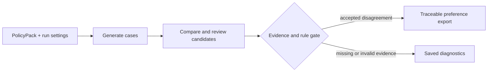

# EcoAlign-Forge

**Turn moderation policies into traceable preference data.**

For ML and data teams building content moderation datasets: define your rules, generate boundary cases, and export candidate preference pairs with the original text, rule evidence and decision history attached.

[Run the demo](#get-started) · [See an output](#from-a-case-to-a-preference-pair) · [Documentation](docs/README.md) · [中文](README_zh.md)

[](https://github.com/dengxianghua888-ops/ecoalign-forge/actions/workflows/ci.yml)
[](pyproject.toml)
[](LICENSE)

## What you can build

| Your task | Use EcoAlign-Forge to |
| --- | --- |
| Explore a new moderation policy | Generate cases around its labels and inspect disagreements and abstentions. |
| Investigate false positives or missed violations | Trace a candidate decision back to the source text, exact evidence span and rule snapshot. |
| Prepare candidate DPO data | Export chosen/rejected responses in TRL or ShareGPT format, with provenance for later review. |

The current Alpha provides the synthesis kernel and run dashboard. The [review workbench preview](https://github.com/dengxianghua888-ops/ecoalign-forge/pull/16) adds human decisions and curated dataset versions on a separate branch.

## From a case to a preference pair

One recorded Chinese demo case contains repetitive advice and a contact invitation:

> 众所周知，坚持努力就会成功。五个技巧：努力、坚持、学习、用心、成功。加微信 raven123 领资料。

| Saved result | Value |
| --- | --- |
| Weak candidate | `T2_Normal` |
| Final gated candidate | `T0_Block` — both moderation dimensions are hit |
| Export | Final candidate as `chosen`; weak candidate as `rejected` |
| Trace | Original text, Unicode evidence positions, rules, policy hash and request lineage |

This is a recorded workflow example, not a model-quality benchmark. A passed gate checks structure, evidence references and policy consistency; it does not turn a machine decision into human ground truth.



## Get started

Use Python **3.11 or 3.12** on macOS/Linux. Installation downloads dependencies; the recorded demo makes **no external model calls** and needs no API key.

```bash
git clone https://github.com/dengxianghua888-ops/ecoalign-forge.git
cd ecoalign-forge
python3 -m venv .venv
source .venv/bin/activate
python -m pip install -e .
python -m ecoalign_forge run --demo --num-samples 5
```

Expect **1 completed case, 1 preference pair, and 4 abstentions** from five fixtures. The status is `partial_failed`, exit **3**: those four cases need external material that the demo does not supply. Their diagnostics are saved instead of inventing a definitive answer.

The command prints the run ID and output path. Runs live under `data/demo/runs/`; exports under `data/datasets/demo/`. Open `pairs.jsonl` for the accepted pair and `manifest.json` for the policy and file hashes.

For a packaged installation, use the wheel and checksums in [GitHub Releases](https://github.com/dengxianghua888-ops/ecoalign-forge/releases). This project does not currently publish to PyPI. The affected `0.3.0a1` release has been withdrawn; use the corrected source or a later release.

## Why this workflow

- **Keep rules attached to data.** Every stage uses the same compiled PolicyPack. Exports preserve the original content, evidence and policy identity so a pair can be inspected later.
- **Resume saved work.** SQLite checkpoints retain complete responses and stage results. Unknown remote requests pause for an explicit decision instead of automatically repeating a potentially charged call.
- **Account for every attempt.** Live runs require a budget cap and model price snapshot. Retries, usage estimates and unsettled reservations remain visible.
- **Use familiar consumers.** TRL standard/conversational formats and LLaMA-Factory ShareGPT are checked with actual loaders, templates, tokenization and collators in separate pinned environments.

## Bring your policy

Start with the built-in Chinese handbook or the [English contact-policy example](examples/contact_policy.en.json). A PolicyPack declares language, labels, evidence requirements, scores, exceptions and an ordered decision table. Packs use a fixed declarative vocabulary and cannot execute code.

For live generation, configure provider credentials in environment variables and supply a [run configuration with prices and a budget](docs/iteration-b-migration.md):

```bash
python -m ecoalign_forge run --mode live --config run-config.json --policy examples/contact_policy.en.json
```

Live mode sends prompts and source content to your configured model provider and may incur charges. The language and label schemas are open; model quality across languages and training gains have not been established. See the [example guide](examples/README.md) before reusing older `PolicyInput` files.

## Inspect runs and exports

Replace `RUN_ID` with the ID printed by your run:

```bash
python -m ecoalign_forge inspect data/demo/runs/RUN_ID
python -m ecoalign_forge resume data/demo/runs/RUN_ID
python -m ecoalign_forge export data/demo/runs/RUN_ID
```

Resume requires the original rule, model, prompt and code identities. Unknown requests require an explicit retry/skip choice. [Recovery and exit codes →](docs/iteration-b-migration.md)

To inspect an actual run in the browser, stay in the repository root:

```bash
python -m pip install -e '.[dashboard]'
python -m streamlit run dashboard/app.py --server.port 8501
```

Select `demo` and your run to view labels, actions, failed cases and budget reservations. The default-branch dashboard is a run inspector. For accept/correct/abstain actions and immutable reviewed datasets, see the [C preview and setup instructions](https://github.com/dengxianghua888-ops/ecoalign-forge/blob/codex/iteration-c/docs/first-user-acceptance.md); it is not yet a released workbench.

## Documentation and contribution

- [Documentation map](docs/README.md) — configuration, recovery, formats and compatibility.
- [Project status](docs/project-status.md) — released, withdrawn and preview versions.
- [Contributing](CONTRIBUTING.md) — run checks, report a reproducible bug or propose a rule example.
- [Changelog](CHANGELOG.md) · [Issues](https://github.com/dengxianghua888-ops/ecoalign-forge/issues)

Code is licensed under [Apache-2.0](LICENSE). Dataset licensing is **unspecified** unless declared in the policy; it does not inherit the code license. Candidate data requires task-specific review before use in training or evaluation.

If the project helps your work, Star it to save and support it. For release notifications, use **Watch → Custom → Releases**.
