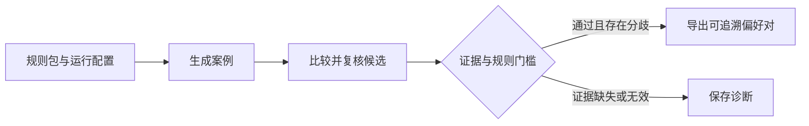

# EcoAlign-Forge

**把内容审核规则，变成可追溯的偏好数据。**

面向构建内容审核数据集的算法与数据团队：定义规则、生成边界案例、比较候选判决，导出带原文、证据和判决记录的训练候选数据。

[运行演示](#快速开始) · [查看一对数据](#从案例到偏好对) · [文档](docs/README.md) · [English](README.md)

## 适合用在哪里

| 你的任务 | 用 EcoAlign-Forge 做什么 |
| --- | --- |
| 探索一套新审核规则 | 围绕规则标签生成案例，检查分歧与无法确认的情况。 |
| 排查误杀或漏判 | 从候选判决回到原文、精确证据位置和当时使用的规则。 |
| 准备 DPO 候选数据 | 导出 TRL 或 ShareGPT 格式的 chosen/rejected，并保留后续复核需要的来源。 |

当前 Alpha 提供合成内核与运行看板。[复核工作台预览](https://github.com/dengxianghua888-ops/ecoalign-forge/pull/16)在独立分支增加人工决定与数据集版本管理。

## 从案例到偏好对

预录中文 Demo 中，一条案例同时包含重复套话与联系方式引导：

> 众所周知，坚持努力就会成功。五个技巧：努力、坚持、学习、用心、成功。加微信 raven123 领资料。

| 保存的结果 | 内容 |
| --- | --- |
| 弱候选判决 | `T2_Normal` |
| 通过门槛的最终候选 | `T0_Block`，两个审核维度均命中 |
| 偏好导出 | 最终候选作为 `chosen`，弱候选作为 `rejected` |
| 可追溯信息 | 原文、Unicode 证据位置、规则、策略 hash 与请求记录 |

这是预录流程示例，不是模型质量跑分。门槛检查结构、证据引用和规则一致性；通过门槛不代表成为人工金标。



## 快速开始

使用 **Python 3.11 / 3.12**，支持 macOS/Linux。安装依赖需要联网；预录演示**不调用外部模型，不需要 API Key**。

```bash
git clone https://github.com/dengxianghua888-ops/ecoalign-forge.git
cd ecoalign-forge
python3 -m venv .venv
source .venv/bin/activate
python -m pip install -e .
python -m ecoalign_forge run --demo --num-samples 5
```

预期结果：五条 fixture 中 **1 条完成、产生 1 对偏好数据，4 条弃权**。状态为 `partial_failed`、退出码 **3**；四条案例需要 Demo 没有提供的外部材料，因此保存诊断，不编造确定答案。

命令会打印 run ID 和输出路径。运行记录位于 `data/demo/runs/`，导出位于 `data/datasets/demo/`。打开 `pairs.jsonl` 查看接受的偏好对，打开 `manifest.json` 核对策略与文件哈希。

也可从 [GitHub Releases](https://github.com/dengxianghua888-ops/ecoalign-forge/releases) 下载 wheel 与校验和安装；目前不发布 PyPI。受影响的 `0.3.0a1` 已撤回，请使用修正后的源码或后续版本。

## 为什么采用这套流程

- **规则随数据一起保存。** 各阶段使用同一编译规则包，导出保留原文、证据和策略标识，方便回查一对数据是怎样产生的。
- **从已保存的进度继续。** SQLite 检查点保留完整响应和阶段结果；远端状态未知时暂停，由使用者明确决定是否重试。
- **每次尝试都有账。** live 运行必须设置金额上限与模型价格快照；重试、usage 估算和未结算预留分别记录。
- **接入已有训练工具。** TRL 普通/对话格式及 LLaMA-Factory ShareGPT 在各自锁定环境中验证真实加载、模板化、tokenize 和 collator。

## 使用自己的规则

可以从内置中文手册开始，也可以参考[英文联系方式规则包](examples/contact_policy.en.json)。PolicyPack 定义语言、标签、证据要求、分值、例外与有序决策表；只使用声明式操作，不执行规则包中的代码。

真实生成前，将供应商密钥放入环境变量，并准备包含价格与预算的[运行配置](docs/iteration-b-migration.md)：

```bash
python -m ecoalign_forge run --mode live --config run-config.json --policy examples/contact_policy.en.json
```

live 模式会向所配置的模型服务商发送提示词和原文，并可能产生费用。结构支持开放语言与标签，跨语言模型质量和训练收益仍需验证。旧 `PolicyInput` 示例的区别见[示例指南](examples/README.md)。

## 查看运行和导出

把 `RUN_ID` 换成实际运行 ID：

```bash
python -m ecoalign_forge inspect data/demo/runs/RUN_ID
python -m ecoalign_forge resume data/demo/runs/RUN_ID
python -m ecoalign_forge export data/demo/runs/RUN_ID
```

恢复要求规则、模型、提示词及代码身份一致。未知请求需要明确选择重试或跳过。[恢复与退出码说明 →](docs/iteration-b-migration.md)

在仓库根目录启动运行看板：

```bash
python -m pip install -e '.[dashboard]'
python -m streamlit run dashboard/app.py --server.port 8501
```

选择 `demo` 与实际 run，查看标签、最终动作、失败案例和预算预留。默认分支提供运行查看；接受、改判、弃权及复核数据集功能位于 [C 预览分支](https://github.com/dengxianghua888-ops/ecoalign-forge/blob/codex/iteration-c/docs/first-user-acceptance.md)，工作台尚未发布。

## 文档与参与

- [文档导航](docs/README.md)：配置、恢复、导出格式与兼容说明。
- [项目状态](docs/project-status.md)：已发布、已撤回及预览版本。
- [贡献指南](CONTRIBUTING.md)：运行检查、提交可复现问题或规则示例。
- [更新记录](CHANGELOG.md) · [问题反馈](https://github.com/dengxianghua888-ops/ecoalign-forge/issues)

代码使用 [Apache-2.0](LICENSE)。数据许可未声明时为**未指定**，不自动继承代码许可证。用于训练或评估前，需要按实际任务复核候选数据。

如果项目对你有帮助，欢迎 Star 收藏与支持；接收版本通知请使用 **Watch → Custom → Releases**。
